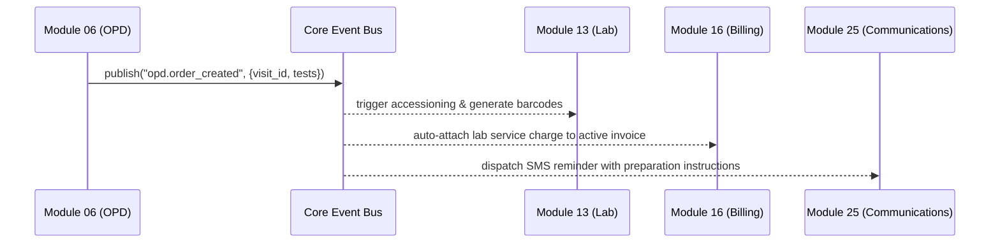

# ApexCare Enterprise Hospital ERP + CRM Architecture Specification

## 1. Executive Summary & Design Vision
**ApexCare** is an enterprise-grade, multi-tenant Hospital ERP (Enterprise Resource Planning) and Patient CRM (Customer Relationship Management) platform designed as a high-performance **Modular Monolith**.

The platform is structured into **33 decoupled domain modules** across 7 operational pillars, ensuring zero code duplication, strict tenant data isolation, sub-second API latency, and compliance with healthcare regulatory frameworks (**HIPAA**, **GDPR**, **HL7 / FHIR**, **DICOM / PACS**, **NABH / JCI**).

```
+---------------------------------------------------------------------------------------------------+
|                                  APEXCARE UNIFIED MODULAR MONOLITH                                |
+---------------------------------------------------------------------------------------------------+
| 01. Authentication & Security  | 02. Users, RBAC & Multi-Tenant  | 03. Patient Master & UHID 360° |
| 04. Doctors & Scheduling       | 05. Appointments & Queue Engine | 06. OPD Electronic Consultations|
| 07. IPD, Wards & Bed Ledger    | 08. Clinical EMR & Rx Formulas  | 09. Nursing Station & MAR       |
| 10. Emergency & Trauma (ESI)   | 11. Operation Theatre & WHO Chk | 12. Pharmacy & Batch Inventory  |
| 13. Diagnostic Lab & Pathology | 14. Radiology & PACS / DICOM    | 15. Blood Bank & Cold Storage   |
| 16. Billing, Cashier & POS     | 17. Insurance, TPA & EDI 837    | 18. Central Inventory & Stores  |
| 19. Procurement, POs & GRN     | 20. Staff, HR & Payroll Ledger  | 21. Duty Roster & SBAR Handover |
| 22. Medical Records (MRD)      | 23. Digital Consents & Sign     | 24. Patient CRM & Leads Pipeline|
| 25. Omnichannel Comms (SMS/WA) | 26. Marketing & Checkup Camps   | 27. Patient Feedback & NPS      |
| 28. Virtual Telemedicine WebRTC| 29. Decision Support (CDSS)     | 30. Executive BI & Analytics    |
| 31. Reporting Engine (PDF/CSV) | 32. HIPAA Security Audit Logs   | 33. Multi-Branch Enterprise     |
+---------------------------------------------------------------------------------------------------+
```

---

## 2. Technical Stack & Architectural Layers

### Backend Infrastructure
- **Language & Runtime**: Python 3.11+
- **Web Framework**: FastAPI (Asynchronous ASGI, OpenAPI 3.0 auto-documentation)
- **ORM & Database Layer**: SQLAlchemy 2.0 (Declarative base, connection pooling, prepared statements)
- **Primary Database**: PostgreSQL 16 (Multi-tenant schema with `tenant_id` foreign keys and composite indexes) / SQLite 3 for local development and unit tests
- **Asynchronous Task Queue**: Celery 5.3 + Redis 7.0 (Message broker for lab critical panic alerts, invoice generation, SMS dispatch)
- **Security & RBAC**: OAuth2 Password Bearer flow with JWT (HS256 / RS256), Bcrypt salted password hashing, 16 granular system roles.

### Frontend Application
- **Framework**: Next.js 14.2+ (React 18, App Router architecture)
- **Type Safety**: TypeScript 5.0+ (Strict mode, zero `any` compiler policies)
- **Styling & Design System**: Tailwind CSS (Medical color palette, responsive glassmorphism, accessible dark/light contrast)
- **Icons & Data Visualization**: Lucide React Icons & Recharts (Area charts, bar charts, multi-axis KPI dials)

---

## 3. Domain Event Bus (Decoupled Inter-Module Communication)
Modules never directly mutate each other's database records. Instead, state transitions publish strongly-typed domain events to the synchronous/asynchronous `event_bus`:



---

## 4. Multi-Tenant Data Isolation Strategy
Every database model inherits from `BaseModel` (`backend/app/models/base.py`), which automatically injects:
1. `id`: Primary key (UUID v4)
2. `tenant_id`: Multi-tenant hospital organization identifier
3. `created_at` / `updated_at`: UTC timestamps
4. `is_active`: Soft-deletion flag
5. `created_by` / `updated_by`: Full audit attribution

---

## 5. Security & Regulatory Compliance
- **HIPAA**: Automatic logging of all Protected Health Information (PHI) lookups in `security_event_logs` and `record_access_logs`.
- **WHO Surgical Safety Checklist**: Mandatory sign-in, time-out, and sign-out checklist enforcement before OT surgery closure.
- **Drug-Drug Safety**: Real-time evaluation of all prescribed pharmaceuticals against the CDSS rules engine before order transmission.
